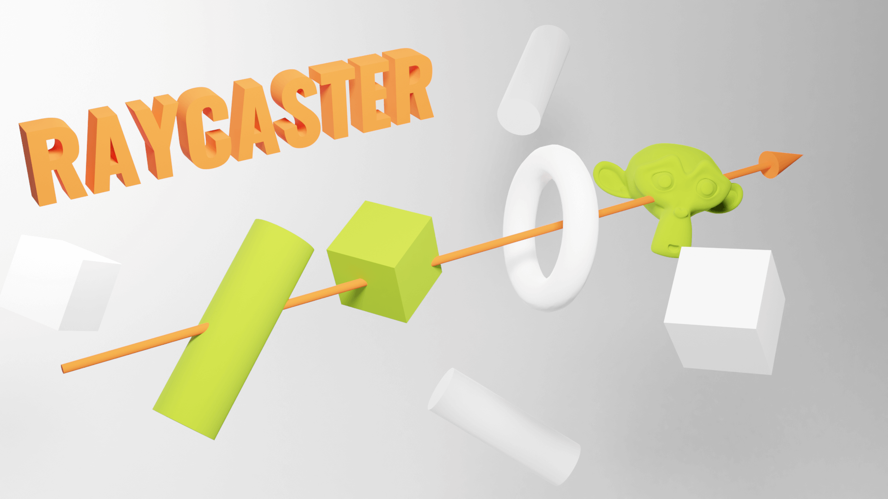

# 19 - raycaster

A [Raycaster](https://threejs.org/docs/#api/en/core/Raycaster) can cast a ray in a specific direction and test which
objects intersect with it.



### How to cast a ray

```typescript
const raycaster    = new Raycaster();
const rayOrigin    = new Vector3(-3, 0, 0);
const rayDirection = new Vector3(10, 0, 0).normalize(); // The direction vector needs to be normalized

raycaster.set(rayOrigin, rayDirection);

const intersects = raycaster.intersectObjects([obj1, obj2, obj3]); // intersectObject() for single object testing
```

Each item returned by this function contains these properties :

- `distance` : The distance between the origin of the ray and the collision point.
- `object` : What object is concerned by the collision.
- `point` : A Vector3 of the exact position in 3D space of the collision.
- `uv`The UV coordinates in that geometry.

You'll need to call `Raycaster.intersectObjects()` on each frame to test moving objects.

Try to limit these calls, because it's CPU heavy.

### Use the raycaster with the mouse

```typescript
const mouse = new THREE.Vector2();

window.addEventListener('mousemove', event => {
    mouse.x = event.clientX / sizes.width * 2 - 1; // [-1 1]
    mouse.y = -(event.clientY / sizes.height) * 2 + 1; // [-1 1]
});
```

Then use `raycaster.setFromCamera(mouse, camera)` to update the ray direction.

#### Mouse enter and mouse leave events

```typescript
let currentIntersect: Intersection | null = null;

const intersects = raycaster.intersectObjects(objects);

if (intersects.length) {
    if (!currentIntersect) {
        console.log('mouse enter');
    }

    currentIntersect = intersects[0];
}
else {
    if (currentIntersect) {
        console.log('mouse leave');
    }

    currentIntersect = null;
}
```

#### Mouse click event

Simply use the `currentIntersect` object :

```typescript
window.addEventListener('click', () => {
    if (currentIntersect) {
        console.log('clicked on an object !');
    }
});
```
