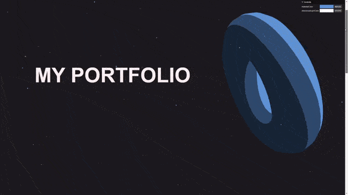

# 20-scroll-based-animation

A simple application of an integrated WebGL experience with some HTML content.

It animates the meshes depending on the cursor and scroll position.



### Note

- Animations are framerate-independent thanks to this code :

```typescript
const elapsedTime = clock.getElapsedTime();
const deltaTime   = elapsedTime - previousTime;
previousTime      = elapsedTime;
...
// Animate meshes
sectionMeshes.forEach(mesh => {
  mesh.rotation.x += deltaTime * .1; // multiply by the time between two frames
  mesh.rotation.y += deltaTime * .15;
});
```

- Animation are also eased/smoothed due to this code :#

```typescript
cameraGroup.position.x += (parallaxX - cameraGroup.position.x) * 2 * deltaTime;
                              ^
                              |
The value approaches parallaxX, but it will never reach it
  
ParallaxX
    ^
    |                              X
    |                       X
    |                 X
    |            X
    |        X
    |     X
    |   X
    |  X
    ---------------------------------> Value over frame
```
