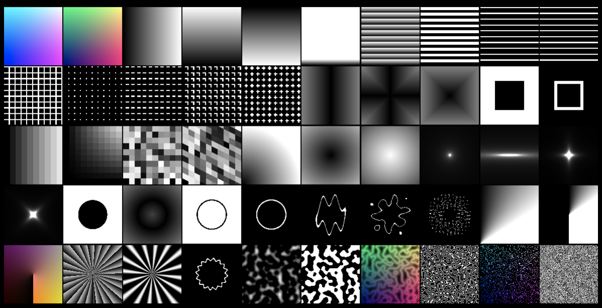

# 28-shader-patterns

50 fragment shaders visible in one screen.

Mathematics are beautiful.

### Quick note about perlin noise

Random generators are always been a complicated topic. How to generate truly random values ?

Or.. How to generate pseudo-random values that looks like the **real world** ?
This was the question *Ken Perlin* was trying to solve in the early 80s for Disney.

Perlin noise algorithm is used countless times to generate **natural-looking** visual effects in films and games.

[Here is a list of GLSL implementations of perlin noise.](https://gist.github.com/patriciogonzalezvivo/670c22f3966e662d2f83)
