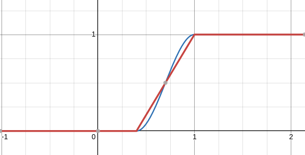

# 32-coffee-smoke-shader

In this lesson, we'll create a shader that will make a coffee cup smoke.

## Perlin noise functions cost a lot of performance

While Perlin noise functions are convenient to use, it is much more efficient to use a texture of a noise pattern.

This is because the noise pattern is precomputed and stored in a texture, so it is much faster to access
than computing the noise on the fly.

## Smoothing the noise

The [smoothstep](https://registry.khronos.org/OpenGL-Refpages/gl4/html/smoothstep.xhtml) function clamps a value
between 0 and 1 with a smooth transition.

For example, this code:

```glsl
smoke = smoothstep(0.4, 1.0, smoke);
//                  ^    ^     ^
//                  |    |     |
//                  |    |     +---> The value to clamp between 0 and 1
//                  |    +---------> The ending/top value. e.g. if the smoke value is 1.2, it will be clamped to 1
//                  +--------------> The starting/bottom value. e.g. if the smoke value is 0.4, it will be clamped to 0
```

Achieves this blue line:


