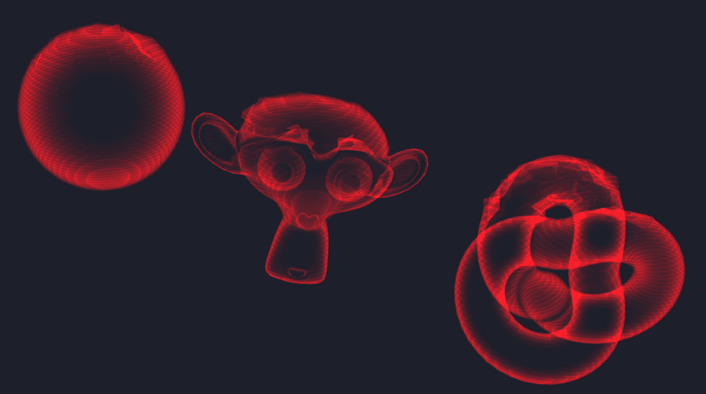
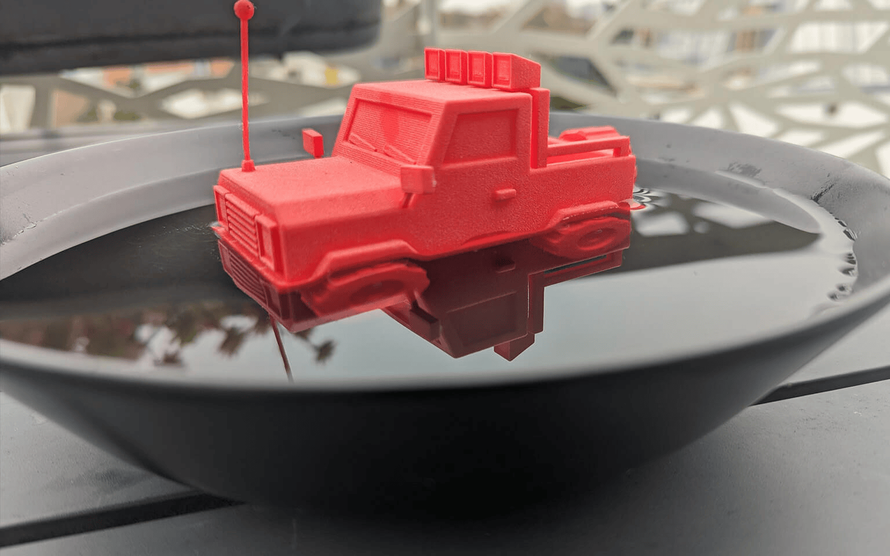
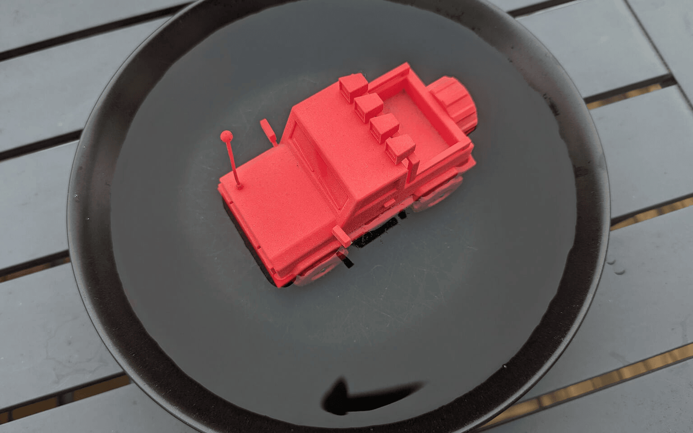
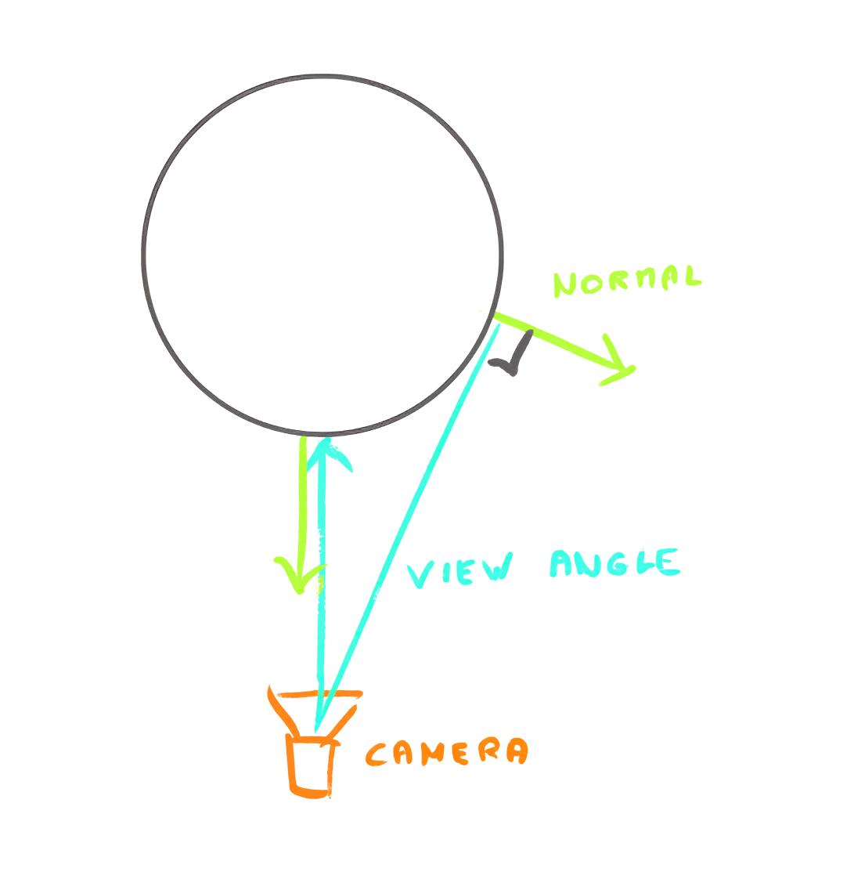
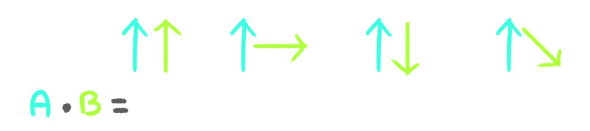
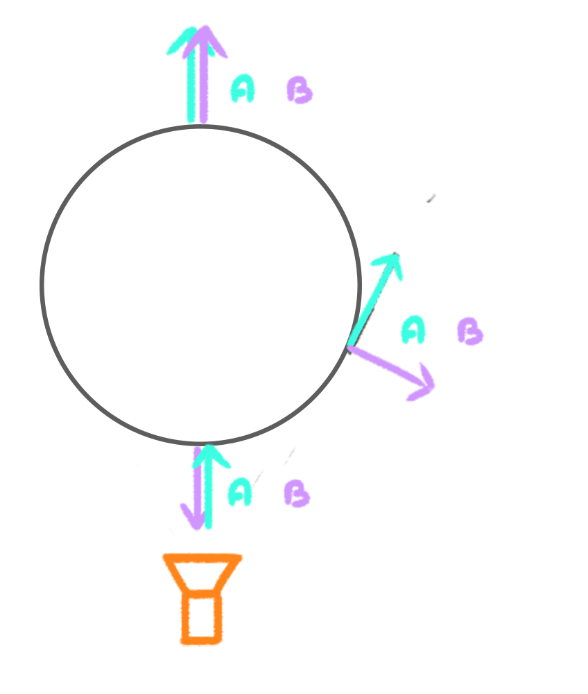

# 33-hologram-shader

This shader creates a hologram effect by using a Fresnel effect.



## Fresnel effect

The Fresnel effect is a phenomenon where the reflectance of a surface changes depending on the viewing angle.

Three.js materials like the `MeshStandardMaterial` are using Fresnel to mimic realistic materials.

Here is an example with photos.

When seen at a narrow angle, the sky reflection is bright and we can hardly see the bottom of the plate:



When seen at a perpendicular angle, we can see the bottom of the plate and we can even notice small scratches:



### Implementation

We want a value to be `1.0` when the view angle is perpendicular to normal and `0.0`
when the view angle is aligned with the normal:



Using the dot product between the view direction and the normal, we can achieve this effect.



We have access to the camera position thanks to the built-in Three.js uniforms and more precisely `cameraPosition`.

*fragment.glsl*
```glsl
void main()
{
    // ...
    vec3 viewDirection = normalize(vPosition - cameraPosition);
    float fresnel = dot(viewDirection, vNormal);

    gl_FragColor = vec4(1.0, 1.0, 1.0, fresnel);
}
```

#### Fix the normal direction

First of all, the Fresnel value shouldn’t change with the object rotation. If you watch the sphere,
you can see that the Fresnel rotates with the sphere, although it should stay the same, relative to the camera.

*vertex.glsl*
```glsl
void main()
{
    // ...

    // Model normal
    vec4 modelNormal = modelMatrix * vec4(normal, 0.0);
    vNormal = modelNormal.xyz;
}
```

*fragment.glsl*
```glsl
void main()
{
    // ...
    vec3 normal = normalize(vNormal);
}
```

When the fourth value is set to `1.0`, it means that our vector is **homogeneous** and all 3 transformations
(translation, rotation, scale) implied by the modelMatrix will be applied, which is perfect in the case of a position.

When the fourth value is set to `0.0`, it means that our vector is **not homogeneous** and the translation
won’t be applied, which is ideal in the case of a normal, because the normal is not a position, it’s a direction.

#### Fix the range

We can’t see anything because the normal vector is oriented toward the camera:



```glsl
void main()
{
    // ...
    float fresnel = dot(viewDirection, vNormal) + 1.0;
}
```
