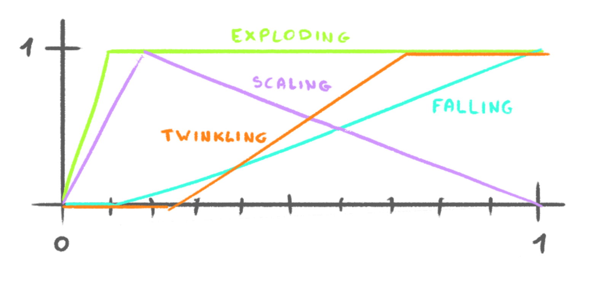

# 34-fireworks-shaders

This shader creates a fireworks effect by using particles.

## Animation

The animation is composed of 5 stages:

- The particles start to expand fast in every direction.
- They scale up even faster.
- They start to fall down slowly.
- They scale down.
- They twinkle as they disappear.

