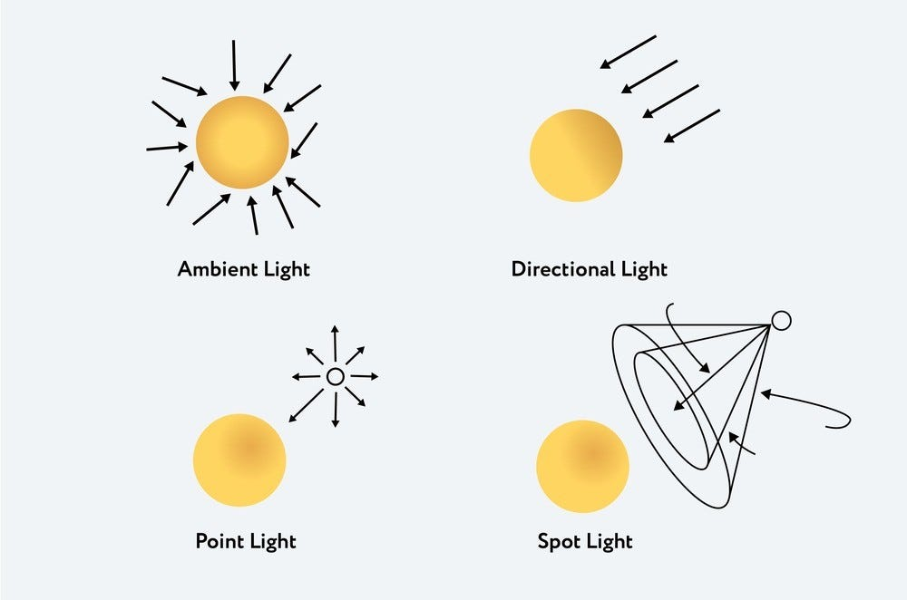

# 35-lights-shading-shaders

This example shows how to use shaders to create three simple light effects:
- Ambient light
- Directional light
- Point light

These effects can then be used within custom shaders.
Using custom shaders with native Three.js lights does not work.
