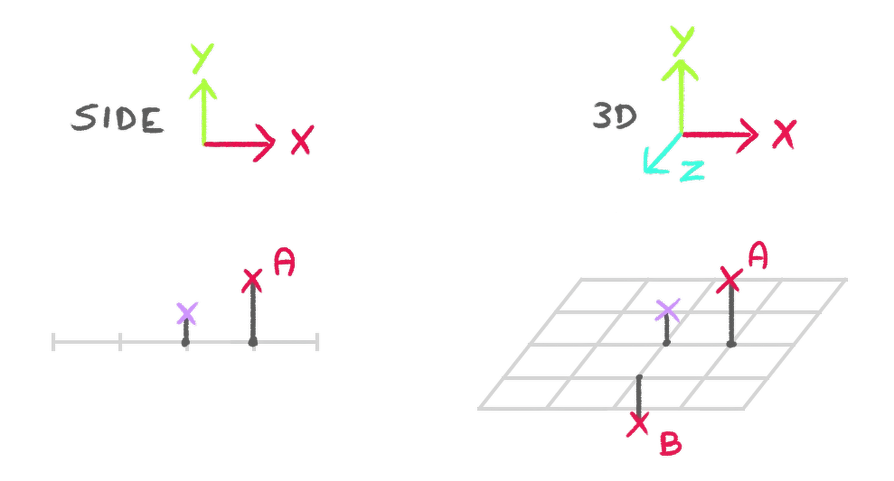

# 36-raging-sea-shading-shaders


## Computing normal vectors in the vertex shader based on neighboring vertices

`Three.js` provides `normal` attribute for each vertex of a `Geometry`.

However, if the geometry is using a **Custom Shader Material**, and if the vertex shader is moving the vertices,
the `normal` attribute will not be updated accordingly.

This is because the `normal` attribute is computed by `Three.js` and is not updated by the vertex shader.

In this case, we can compute the normal vectors in the vertex shader based on the neighboring vertices.

### Computing the position of two neighboring vertices

One neighbour will be further away on the `x` axis (let’s call it `A`)
and another neighbour will be further away on the `z` axis (let’s call it `B`):


We then update the elevation of those neighbours exactly like we did for the current vertex:



### Computing the normal vector

We can then compute the normal vector by taking the cross product of the vectors `XA` and `XB`:


Here is an example of a code:

```glsl
void main() {
    // Base position
    float shift = 0.01;
    vec4 modelPosition = modelMatrix * vec4(position, 1.0);
    vec3 modelPositionA = modelPosition.xyz + vec3(shift, 0.0, 0.0);
    vec3 modelPositionB = modelPosition.xyz + vec3(0.0, 0.0, -shift);

    // Elevation
    modelPosition.y += waveElevation(modelPosition.xyz);
    modelPositionA.y += waveElevation(modelPositionA);
    modelPositionB.y += waveElevation(modelPositionB);

    // Normal
    vec3 toA = normalize(modelPositionA - modelPosition.xyz);
    vec3 toB = normalize(modelPositionB - modelPosition.xyz);
    vec3 computedNormal = cross(toA, toB);

    // Final position
    gl_Position = ...;

    // Varyings
    vNormal = computedNormal;
}
```
