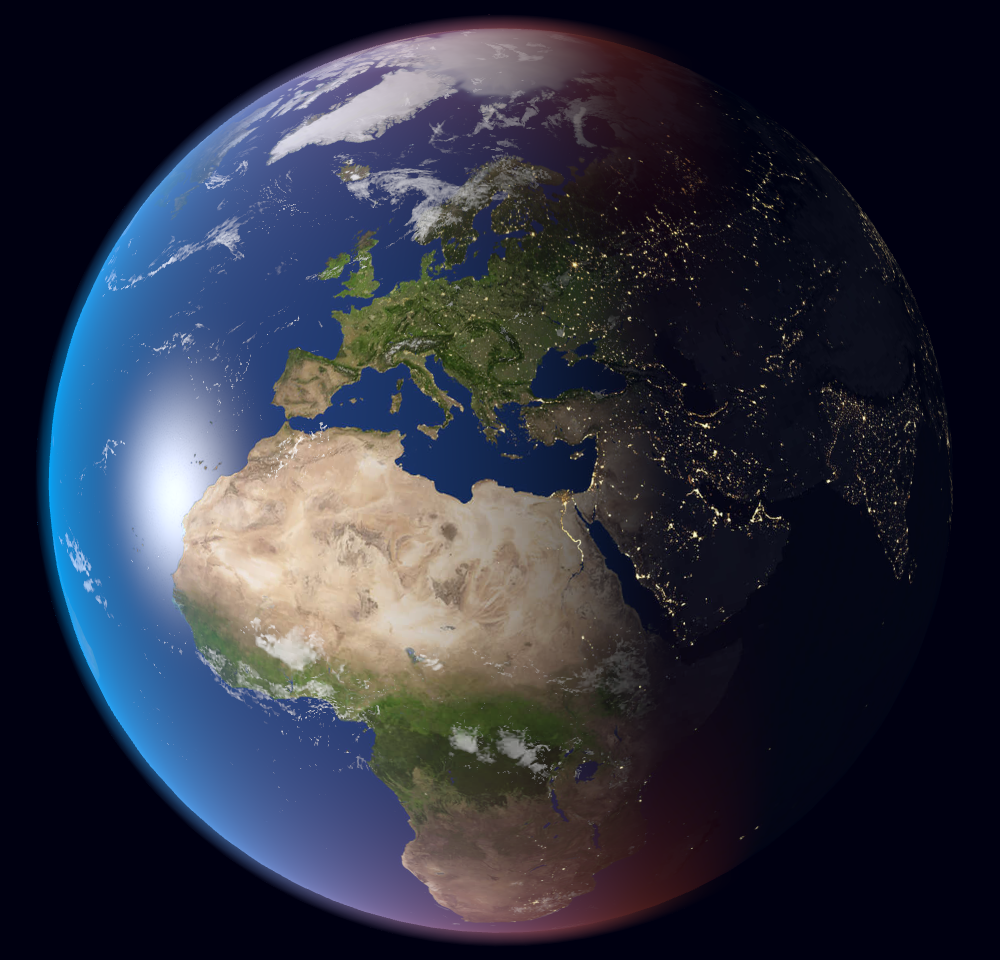
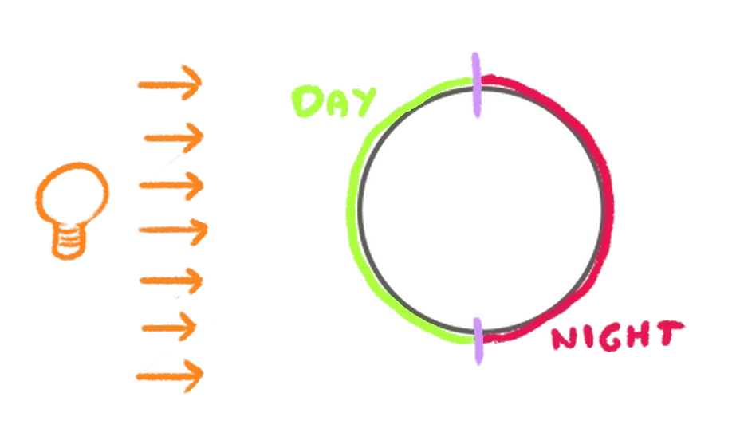
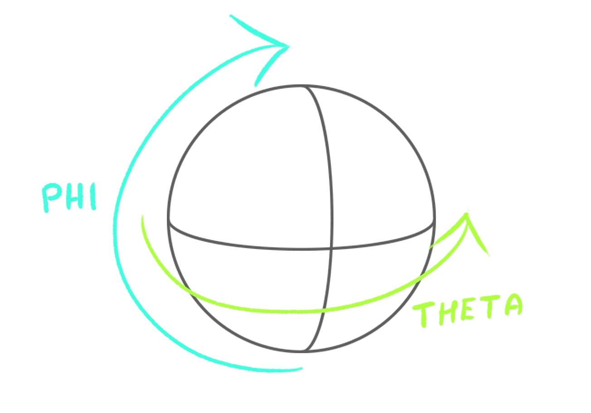
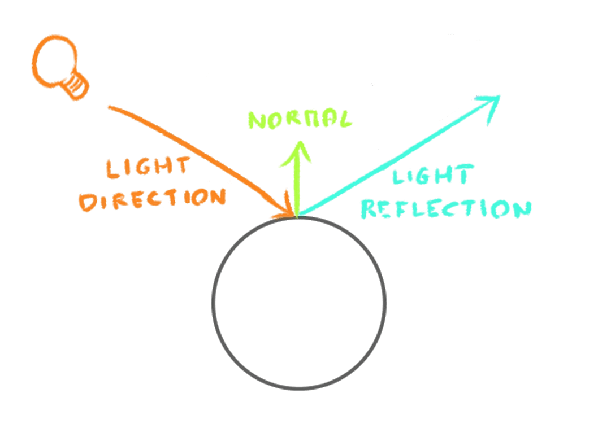

# 38-earth-shaders



This lesson uses textures coming from this [website](https://www.solarsystemscope.com/textures/).

There are 3 textures used in this lesson:
- `day.jpg` : This is the texture of the earth during the day.
- `night.jpg` : This is the texture of the earth during the night.
- `specularClouds.jpg` : This texture contains both the specular (where it's reflecting the light) and the clouds data.
Combining data like this reduces the amount of memory we allocate to the GPU.

## Day / Night

The day and night textures are combined using the `mix` function in the fragment shader.

We want the mixing factor to be 1.0 on the side facing the sun and 0.0 on the other side:



```glsl
void main() {
    // Sun orientation
    vec3 uSunDirection = vec3(0.0, 0.0, 1.0);
    float sunOrientation = dot(uSunDirection, normal);
    
    // Mix day and night textures
    float dayMix = smoothstep(- 0.25, 0.5, sunOrientation); // clamp and smooth the value
    vec3 dayColor = texture(uDayTexture, vUv).rgb;
    vec3 nightColor = texture(uNightTexture, vUv).rgb;
    color = mix(nightColor, dayColor, dayMix);
}
```

## Sun

For now, the sun is only managed as a direction in the GLSL.

Let's handle it in the JavaScript code.

To place it in the right position, we use the [Spherical](https://threejs.org/docs/#api/en/math/Spherical)
class from Three.js.



```typescript
// Sun coordinates
const sunSpherical = new THREE.Spherical(1, Math.PI * 0.5, 0.5); // Radius, Phi, Theta
const sunDirection = new THREE.Vector3().setFromSpherical(sunSpherical);
```

## Anisotropy

If you check the textures at a narrow angle, you’ll notice that they are slightly blurred.

This makes perfect sense because of the texture resolution and the magnification filter. We could try another `magFilter`
on the texture, but there is actually another solution named `anisotropy`.

`anisotropy` is a property available on textures that will improve the sharpness of the texture when seen at a narrow angle
by applying different levels of filtering.

```typescript
renderer.capabilities.getMaxAnisotropy(); // usually 8 or 16. 1 means no anisotropy

const earthDayTexture = textureLoader.load('./earth/day.jpg');
earthDayTexture.colorSpace = THREE.SRGBColorSpace;
earthDayTexture.anisotropy = 8;
```

Note that the anisotropy can have a performance impact. In this case, it’s not noticeable, but it’s something to keep in.

## Clouds

The clouds are managed in the same way as the day and night textures.

```glsl
void main() {
    // Clouds
    float cloudsMix = smoothstep(0.5, 1.0, specularCloudColor.g);
    cloudsMix *= dayMix;    // Only show clouds during the day
    color = mix(color, vec3(1.0), cloudsMix);
}
```

## Reflection

Same as the lights shader, we can add a reflection to the earth.



```glsl
void main() {
    // Sun reflection
    vec3 reflection = reflect(- uSunDirection, normal);
    float specular = - dot(reflection, viewDirection);
    specular = max(specular, 0.0);
    specular = pow(specular, 32.0);
    specular *= specularCloudColor.r;   // Only show reflection on the oceans
    vec3 specularColor = mix(vec3(1.0), atmosphereColor, fresnel); // The reflection color is like the atmosphere on the edges 
    color += specular * specularColor;
}
```
