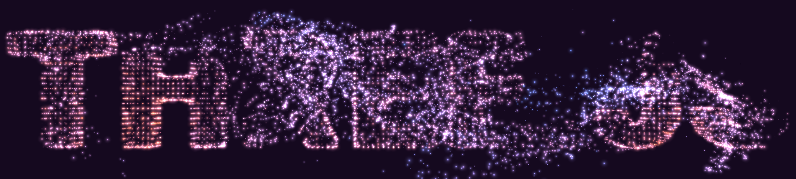
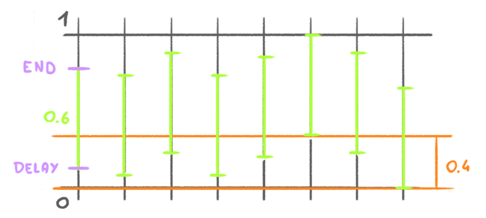
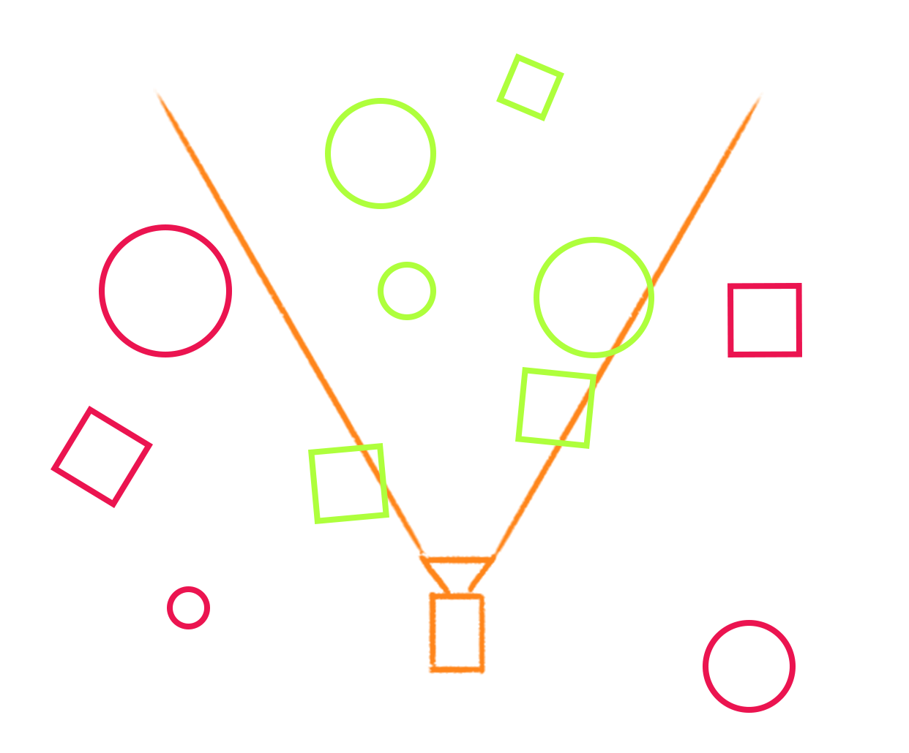

# 40-particles-morphing-shader

This example shows how to create a shader that morphs between two models.



There are multiple ways of doing it:

- Do it in `Javascript` by updating the attribute itself. But this is bad for performance.
- Do it by using `GPGPU` (General Purpose GPU). This is a good solution but it’s difficult. See the next lesson for more information.
- Do it by using the `vertex shader`. This is the solution we are going to use in this lesson.

The idea is to send two sets of positions to the vertex shader, one being the initial shape and the other being the targeted shape.

The vertex shader will then interpolate between the two shapes based on a `uniform uProgress` value.

```glsl
uniform vec2 uResolution;
uniform float uSize;
uniform float uProgress;

// attribute vec3 position; - Already defined by three.js
attribute vec3 aPositionTarget;
attribute float aSize;

#include ../includes/simplexNoise3d.glsl

void main() {
    // Mixed position
    float noiseOrigin = simplexNoise3d(position * 0.2);
    float noiseTarget = simplexNoise3d(aPositionTarget * 0.2);
    float noise = mix(noiseOrigin, noiseTarget, uProgress);
    noise = smoothstep(-1.0, 1.0, noise);

    float duration = 0.4;
    float delay = (1.0 - duration) * noise;
    float end = delay + duration;
    float progress = smoothstep(delay, end, uProgress);
    vec3 mixedPosition = mix(position, aPositionTarget, progress);

    // Final position
    vec4 modelPosition = modelMatrix * vec4(mixedPosition, 1.0);
    vec4 viewPosition = viewMatrix * modelPosition;
    vec4 projectedPosition = projectionMatrix * viewPosition;
    gl_Position = projectedPosition;

    // Point size
    gl_PointSize = uSize * uResolution.y * aSize;
    gl_PointSize *= (1.0 / - viewPosition.z);
}
```

Here is a schema explaining the animation:



## Fix frustum culling

When morphing between two shapes, the bounding box of the geometry is not updated.
This can lead to the geometry being not rendered when it should not be.



To fix this issue, either:

- Disable frustum culling by setting `mesh.frustumCulled = false`. Not recommended because the mesh will be rendered even if it’s not visible.
- Update the bounding box of the geometry.