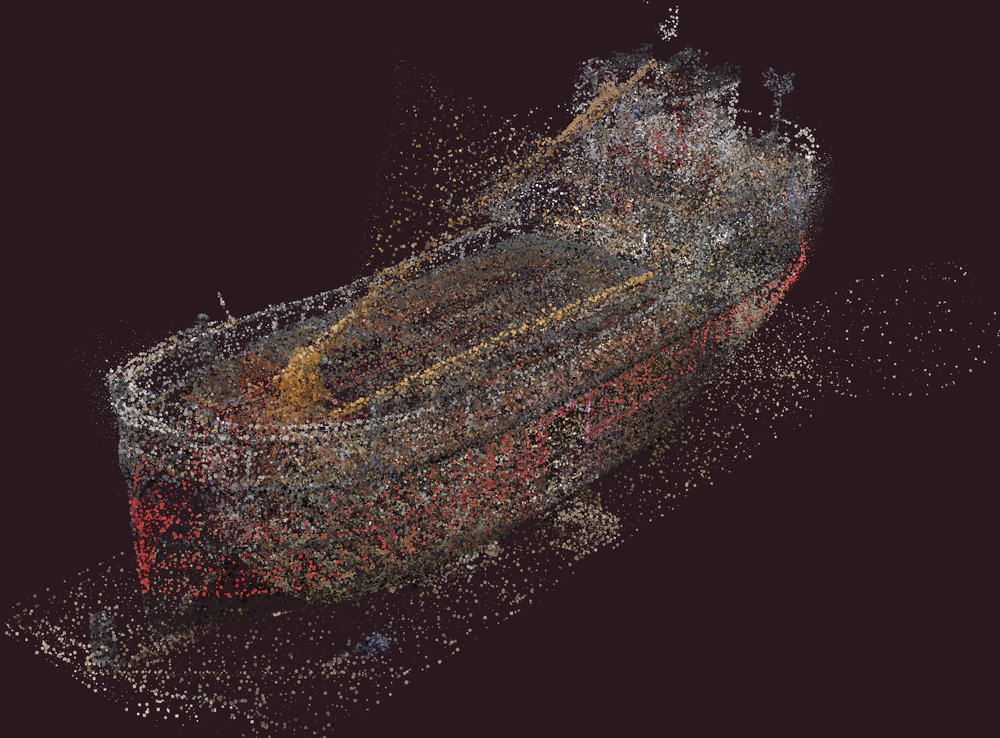
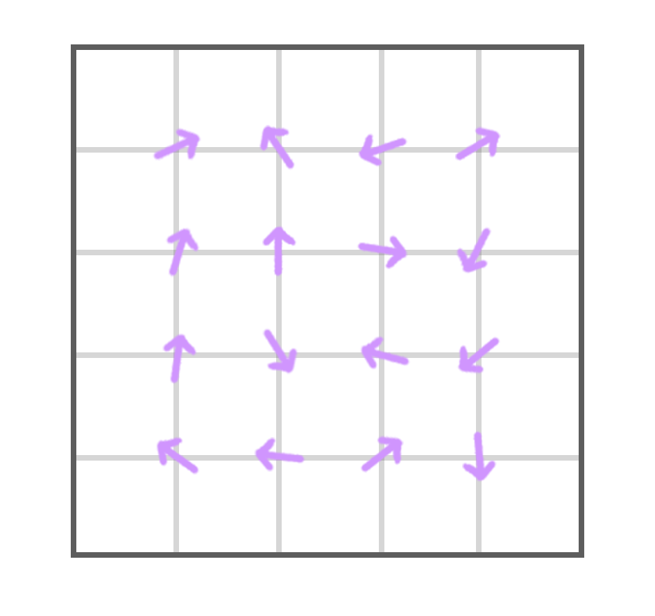
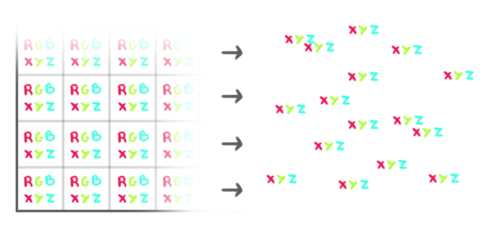
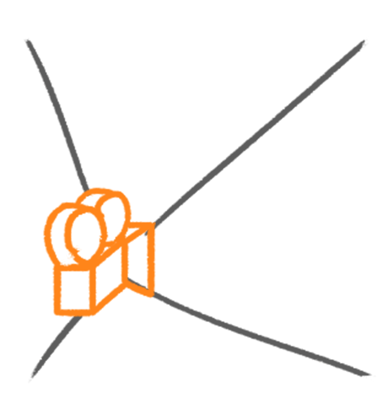
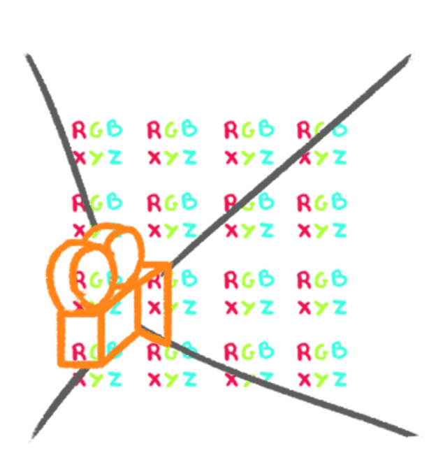
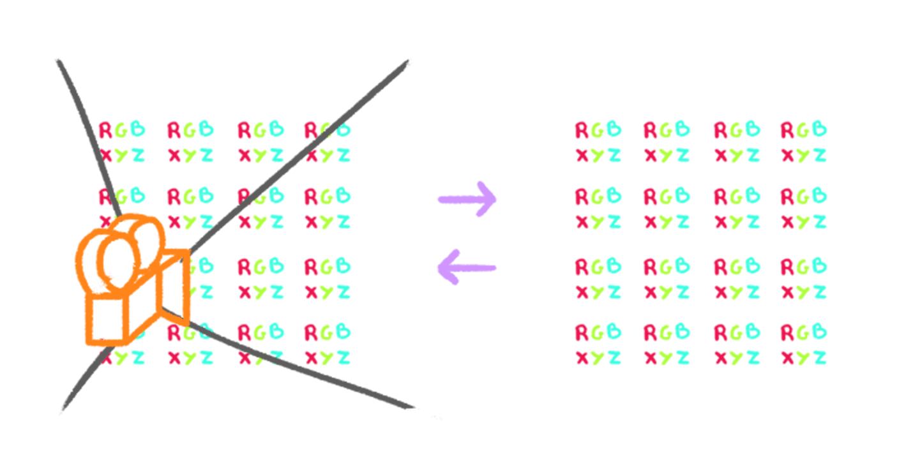

# 41-gpgpu-flow-field-particles-shaders

This example is a GPGPU flow field particles simulation.

Two techniques are used in this example:
- **Flow field**: A 2D grid of vectors that define the direction of the particles.
- **GPGPU**: **G**eneral-**p**urpose computing on **g**raphics **p**rocessing **u**nits:
Using the GPU to perform calculations that are not necessarily related to graphics.

## Flow field

For any point in space, the flow field defines a vector that indicates the direction to follow.
This vector can be used to move particles in a specific direction.

Unfortunately, a flow field takes up a considerable amount of computing power. As a result, doing the calculation for
each frame for thousands and thousands of particles using just the CPU wouldn’t be possible.

### Persistence

An important aspect of the problem is that the data needs to persist. Until now, when doing animation on particles,
we have been calculating a sort of snapshot of where all particles should be.

In the case of a flow field, the trajectory of the particle is unpredictable and keeps on evolving with time.
We need to save the current position of all particles to use it on the next frame.

GPGPU helps us process data using the GPU. To do that, it utilizes what we call **FBO** (**F**rame **B**uffer **O**bject).

FBOs are textures in which we save the renders instead of doing it on the `<canvas>` and they can be created in Three.js
using `WebGLRenderTarget`.

In the case of particles, we use each pixel of the texture for one particle where the `RGB` channels correspond to the `XYZ` coordinates.
And the `A` channel can be used for something else if we need (the time is this case).

## GPGPU

Although it may seem very interesting, creating our own GPGPU is difficult. Fortunately, Three.js provides a way to do it.

Here’s how it would go if we were to do it ourselves.

1. Create a new offscreen scene. In this scene, we put a camera facing a plane which fills the camera view perfectly.

2. To that plane, we apply a custom shader. To that custom shader, we send the FBO texture containing the position of the particles. 
But instead of just displaying the texture, the custom shader updates the pixels, thus updating the particles.

And this is where we calculate and apply the flow field to the pixels as if the `RGB` channels were `XYZ` coordinates.

Then, before rendering the real scene, we render that offscreen scene using the offscreen camera and save the result in an FBO.

For the next frame, we send the result of the previously rendered FBO to the plane shader and complete a new render while applying the flow field again to the pixels.

And again for the next frame. And again, and again.

### Unfortunately, it’s not that simple

First, we can’t read and write in the same FBO, which is why we need to have two of them and to invert them on each new update.
We call this way of doing things the “ping-pong buffers”.

Secondly, using pixel as data is difficult because of the various formats and types a pixel can have.

Finally, we need to complete the setup with almost nothing on screen until it works. This is why debugging a GPGPU is very complex.

## GPUComputationRenderer to the rescue

Fortunately, there is a Three.js class to solve that issue.

`GPUComputationRenderer` will do most of the heavy lifting such as creating the scene, handling the ping-pong buffers,
setting the color format properly, rendering, etc.

Here is the [code documentation](https://github.com/mrdoob/three.js/blob/8286a475fd8ee00ef07d1049db9bb1965960057b/examples/jsm/misc/GPUComputationRenderer.js).

And there are some examples: https://threejs.org/examples/?q=gpgpu#webgl_gpgpu_birds

