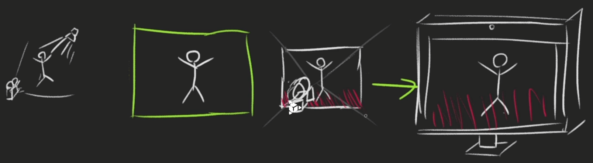
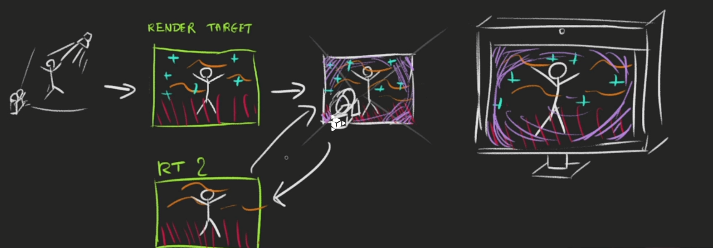

# 32-post-processing

Post-processing is about adding effects on the final render.

Here are some examples :

- Depth of field
- Bool
- Motion blur
- Glitch or drunk effect
- Color variations
- Antialiasing

## How it works

### Render with a single post-processing effect (*pass*)

We first render into a **render target** (commonly named **buffer** in OpenGL).

Then we apply a post-processing pass into this target with a fragment shader.

Finally, Three.js will render this target into the final canvas.



### Render with multiple post-processing effects (*passes*)

#### Ping-pong buffering

We can have multiple passes on our post-process: one doing the motion blur, one doing the color changes,
one doing the depth of field, etc.

Because we can have multiples passes, the post-processing needs two render targets.

The reason is that we can't get the texture of a render target while drawing in it at the same time.
The idea is to draw in the first render target while taking the texture from the second one.
At the next pass, we switch those render targets, take the texture from the second, and draw on the first.



## Post-processing in three.js

[`EffectComposer`](https://threejs.org/docs/index.html#examples/en/postprocessing/EffectComposer) will handle all the
process
of creating the render targets, doing the ping-pong thing, sending the texture of the previous pass to the current pass,
drawing the last one on the canvas, etc.

```typescript
const effectComposer = new EffectComposer(renderer);
effectComposer.setSize(sizes.width, sizes.height);
effectComposer.setPixelRatio(renderer.getPixelRatio());

// Mandatory pass
const renderPass = new RenderPass(scene, camera);
effectComposer.addPass(renderPass);

// Post-processing pass
const dotScreenPass = new DotScreenPass(); // For example..
effectComposer.addPass(dotScreenPass);

const tick = () => {
  // ...

  // Render
  // renderer.render(scene, camera)
  effectComposer.render(); // Render with the effectComposer instead of the default renderer

  // ...
}
```

### Creating our own pass

```typescript
const rgbShader = {

  uniforms: {
    tDiffuse: {value: null}, // Get the texture from the previous pass
    uRGB: {value: null} // let it null per default, then pass the value in the js code
  },

  vertexShader: `
        varying vec2 vUv;

        void main()
        {
            gl_Position = projectionMatrix * modelViewMatrix * vec4(position, 1.0);

            vUv = uv;
        }
    `,

  fragmentShader: `
        uniform sampler2D tDiffuse;
        uniform vec3 uRGB;

        varying vec2 vUv;

        void main()
        {
            vec4 color = texture2D(tDiffuse, vUv);
            color.rgb += uRGB;

            gl_FragColor = color;
        }
    `
}

const rgbPass = new ShaderPass(rgbShader);
effectComposer.addPass(rgbPass);
tintPass.material.uniforms.uRGB.value = new THREE.Vector3(1, 1, 0);
```

## Performance

Be careful, each pass is one more render for the GPU. This process is extremely performance-expensive.

Try to merge multiple passes into a single pass to lower the number of renders.
