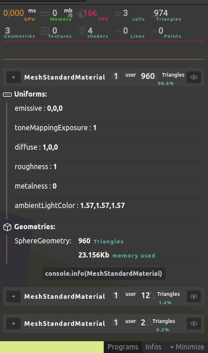

# 44 - Debug a R3F application

## React Strict mode

It will warn you about potential problems in your application :

- Unused import
- Infinite render loop
- Forgotten `useEffect()` dependencies
- Deprecated practices
- Etc.

```typescript jsx
import { StrictMode } from 'react';

root.render(
  <StrictMode>
    <Canvas>
      ...
    </Canvas>
  </StrictMode>
)
```

## React browser extension

By clicking the **Components** tab in the devtools (added by the extension), you can see all component rendered.

By default, some component will not be displayed here,
disable the filter in the settings > Components > Hide components where ...

## Debugging with Leva

[Leva](https://github.com/pmndrs/leva) is a new library for tweaking React components easily.

## Monitoring with r3f-perf

[R3F-perf](https://github.com/utsuboco/r3f-perf) let you monitor your performance easily.


