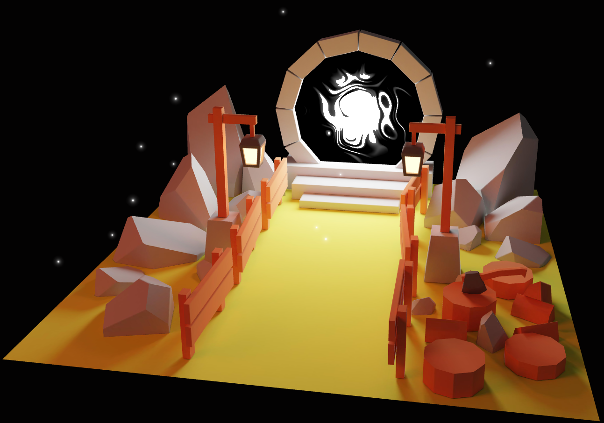

# 48 - Portal scene with r3f

This time, we are going to recreate the portal scene.



## Colors

By default, R3F sets a `toneMapping`.

This toneMapping is usually welcome and colors look better with it.
However, we don’t want it because our scene has been baked from Blender which has already applied
tone mapping with its color management system.

To disable the default `toneMapping`, use:

```jsx
<Canvas flat>
  ...
</Canvas>
```

## Drei helpers

Don't forget to take advantages of [Drei](https://github.com/pmndrs/drei) helpers.

It has many helpers, for example a helper for the
[floating glowing particles](https://github.com/pmndrs/drei?tab=readme-ov-file#sparkles)
or the [shaders](https://github.com/pmndrs/drei?tab=readme-ov-file#shadermaterial).
