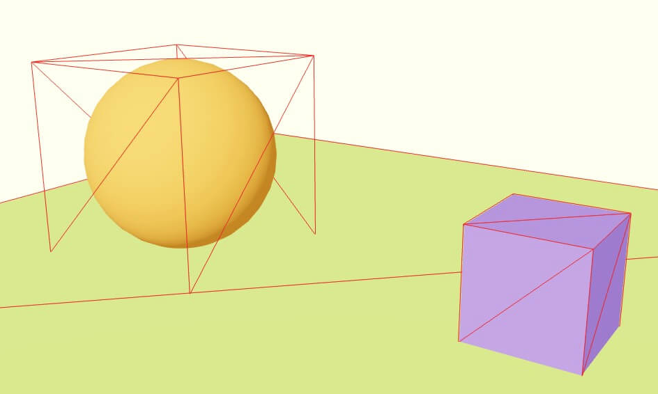

# 52-physics-with-r3f

## From Cannon to Rapier

In the previous Physics lesson, we used Cannon.js to handle the physics part.
Unfortunately, the code hasn't been updated for many years.

Thankfully, [Rapier](https://rapier.rs/) was created in 2019.
It’s written in Rust and works in JavaScript thanks to WebAssembly.

Apart from Rust being the best low-level language (which has been integrated in the Linux Kernel!), Rapier
is much more performant than Cannon.js.

## React Three Rapier

Once again, thanks to the guys developing React Three Fiber, we can easily leverage the power of Rapier
with [React Three Rapier](https://github.com/pmndrs/react-three-rapier).

## Setup

Yes, it is as easy as created a `Physics` components, with `RigidBody` children.

```jsx
<Physics debug={true}> {/* The debug mode adds Wireframe arounds bodies */}
    <RigidBody>
        <mesh position={ [ - 2, 2, 0 ] }>
            <sphereGeometry />
            <meshStandardMaterial color="orange" />
        </mesh>
    </RigidBody>
</Physics>
```

Here are a few things to notice:

- We don’t have to update the physics in each frame.
- Three.js objects are automatically associated with the corresponding RigidBody surrounding them.
- React Three Rapier creates a physics shape that seems to match the Three.js objects.
- We don’t have to specify things like surface properties, object mass, gravity, etc.

## Colliders

Colliders are the shapes that make up our `RigidBodies`.

By default, React Three Fiber automatically generates colliders.



They fits well with cubes and rectangles. But in case of more complex geometries,
we might need to provide custom colliders.

```jsx
<RigidBody colliders="ball">
    <mesh position={ [ - 2, 2, 0 ] }>
        <sphereGeometry />
        <meshStandardMaterial color="orange" />
    </mesh>
</RigidBody>
```

Check the [docs](https://rapier.rs/docs/user_guides/javascript/colliders#shapes) for a full list of available colliders.

## Access the body and apply forces / impulsion

```jsx
export default function Experience() {
  const cube = useRef();

  function onClickCube() {
    cube.current.applyImpulse({ x: 0, y: 5, z: 0 });         // translation
    cube.current.applyTorqueImpulse({ x: 0, y: 0.5, z: 0 }); // rotation
  }

  function togglePointer() {
    document.body.style.cursor =
      document.body.style.cursor === "pointer" ? "" : "pointer";
  }

  return (
    <>
      <Physics>
        <RigidBody
          ref={cube}
          colliders={false}
          onCollisionEnter={onCollisionEnter}
        >
          <CuboidCollider mass={0.5} args={[0.5, 0.5, 0.5]} />
          <mesh
            onClick={onClickCube}
            onPointerEnter={togglePointer}
            onPointerLeave={togglePointer}
          >
            <boxGeometry />
            <meshStandardMaterial color="mediumpurple" />
          </mesh>
        </RigidBody>
      </Physics>
    </>
  );
}
```

## Events

We can listen to events by adding attributes directly on the `RigidBody`.

There are 4 different events:

- `onCollisionEnter`: when the RigidBody hit something.
- `onCollisionExit`: when the RigidBody separates from the object it just hit.
- `onSleep`: when the RigidBody starts sleeping.
- `onWake`: when the RigidBody stops sleeping.

```jsx
function onCollisionEnter() {
  console.log('collision!');
}

// ...

<RigidBody
    ref={ cube }
    onCollisionEnter={ onCollisionEnter }
>
    {/* ... */}
</RigidBody>
```
